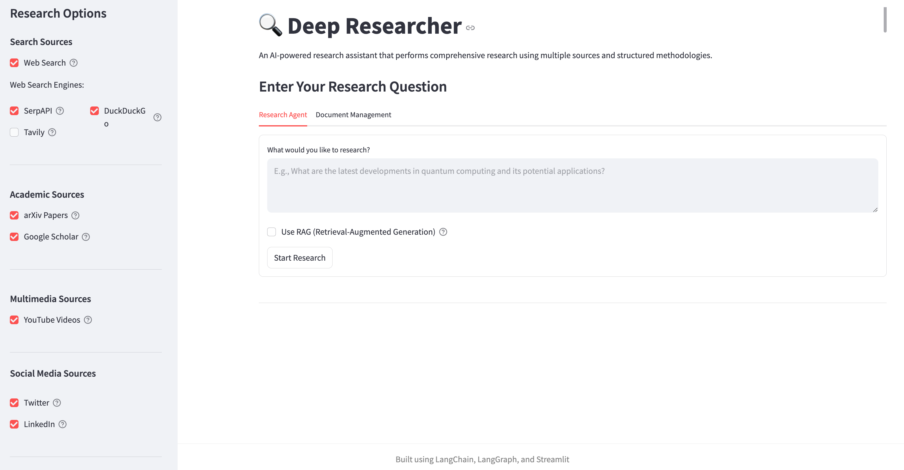

# 🔍 Deep Researcher

Deep Researcher is a powerful research agent built with LangChain and LangGraph that helps you conduct comprehensive research on any topic by leveraging multiple data sources.



## 💡 Features

- Answer research queries using AI-powered reasoning
- Search the web using multiple search engines:
  - SerpAPI (Google search results)
  - DuckDuckGo (privacy-focused search)
  - Tavily (AI-powered search optimized for research)
- Search academic papers from arXiv and Google Scholar
- Find relevant YouTube videos
- Discover insights from Twitter and LinkedIn posts
- Upload local documents to include in research
- Send research results via email
- Interactive visualization of the agent's reasoning process
- Customizable search options - enable/disable specific search features

## 🔧 Installation

For detailed installation instructions and troubleshooting tips, please see the [Installation Guide](INSTALLATION.md).

Quick start:

1. Clone this repository:
```bash
git clone https://github.com/Sallyliubj/Deep-Researcher.git
cd Deep-Researcher
```

2. Create and activate a virtual environment:
```bash
python - m venv .venv
source .venv/bin/activate
```

3. Install required dependencies:
```bash
pip install -r requirements.txt
```

4. Set up Ollama locally for the LLM:
```bash
# Install Ollama if not already installed
curl -fsSL https://ollama.com/install.sh | sh

# Pull the Gemma model
ollama pull gemma3:1b
```

5. Create a `.env` file in the root directory with your API keys (see `.env.example`).

## 🔭 Usage

1. Start the Streamlit app:
```bash
export PYTHONPATH=$(pwd)
streamlit run app/main.py
```
Or use the provided shell script:
```bash
./run.sh
```

2. Open your browser and go to `http://localhost:8501`

3. Enter your research query, select the search options you want to enable, and click "Research"

4. View the results, LangGraph visualization, and send the results to an email if desired

## 🌐 Web Search Options

Deep Researcher offers multiple web search options:

- **SerpAPI**: Provides Google search results (requires API key)
- **DuckDuckGo**: Privacy-focused search engine (no API key required)
- **Tavily**: AI-powered search engine optimized for research (requires API key)

You can enable or disable any of these search engines from the sidebar.

## 🧩 Architecture

This project uses:
- LangChain for orchestrating the various AI components and tools
- LangGraph for creating a dynamic research workflow with self-reflection capabilities
- Ollama (gemma3:1b) for local AI model inference
- Streamlit for the web interface
